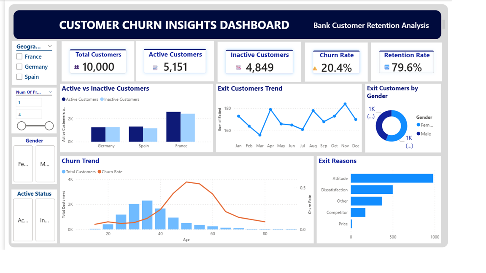

**Customer Churn Analysis Dashboard**

---

 **Project Overview**

Customer churn is a critical business problem impacting revenue and growth. This project analyzes customer churn behavior in a banking dataset and provides insights to improve retention.

---

 **Business Objectives**

✔ Analyze overall churn rate
✔ Identify high-risk customer segments
✔ Understand churn patterns across regions and demographics
✔ Provide actionable business insights

---

**Dataset Information**

*  Total Records: **10,000 customers**
*  Features:

  * Age, Gender, Geography
  * Balance, Credit Score, Tenure
  * Number of Products, Active Status
  * Churn Status (Exited / Retained)

---

 **Tools & Technologies**

*  SQL → Data extraction & cleaning
*  Python → Exploratory Data Analysis
*  Power BI → Dashboard & visualization

---

 **Dashboard Features**

*  KPI Cards (Customers, Churn Rate, Retention Rate)
*  Interactive Filters (Geography, Gender, Products)
*  Trend Analysis (Monthly churn, customer behavior)
*  Exit Reasons Breakdown

---

 **Key Insights**

*  France has highest churn despite large customer base
*  Customers aged **40–60** show high churn risk
*  "Attitude" is the main reason for churn
*  Inactive customers are more likely to churn

---

 **Dashboard Preview**

---

 **Business Impact**

This dashboard helps businesses:

* Identify high-risk customers
* Improve retention strategies
* Make data-driven decisions

---

 **Future Enhancements**

* Add Machine Learning churn prediction
* Build real-time dashboard
* Advanced segmentation & cohort analysis

---

## 📌 **Conclusion**

This project demonstrates how data analytics can be used to understand customer behavior and improve business performance through actionable insights.
